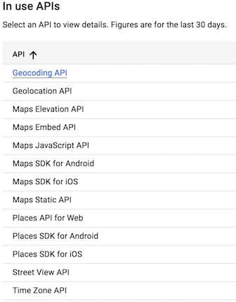

Instructions to obtain your Google API key.

* Start off by clicking the Get Started button on the [Google Maps Platform](https://cloud.google.com/maps-platform/) webpage.

* Select the boxes for the Maps and Places products.

* At this point, click Create a New Project and give the project a name. Once that has been done, click Create Billing Account. While Google now charges for services, a $200 credit is provided for these API services.

* Any API usage beyond the $200 credit will be charged to your personal account. Refer to the [Google Cloud Billing Documentation](https://cloud.google.com/billing/docs/how-to/budgets). API usage limits and billing alerts can be setup so that the free credit is not exceeded.

    * Navigate through the Acceptances to try the cloud platform, then complete the next form to establish a Google Cloud Platform account.

    * The following windows will automatically enable the Google Maps Platform. Once complete, a window containing a unique API key will appear. Copy this key for use in Python.

* Refer to the [Capping Queries document](Capping_Queries.md) to set query limits for API usage.

    * You can begin following the document from step 3 if you have not navigated away from your list of active APIs.

