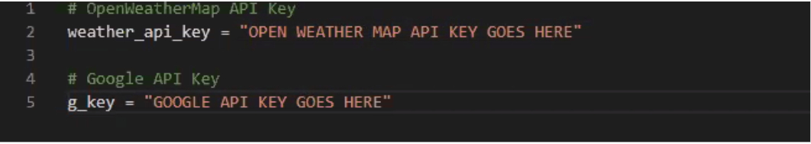

# python-api-challenge

## To make this work:
* After cloning, create a file called api_keys.py
* You will need to have a open weather map api key which you can get [here](https://openweathermap.org/).
* You will need a google api key, follow these [instructions](./Google_APIKey.md) to obtain one.
* After obtaining api keys, add them to your api_keys.py.  Your file should look like this:

